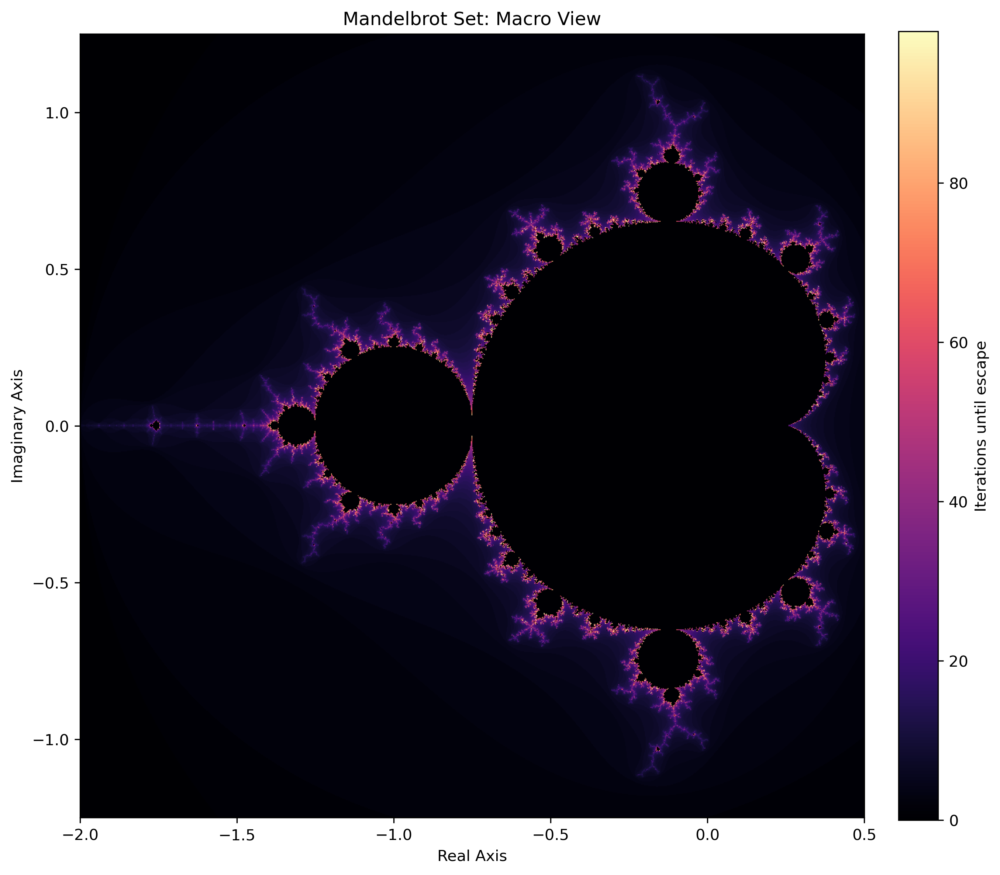
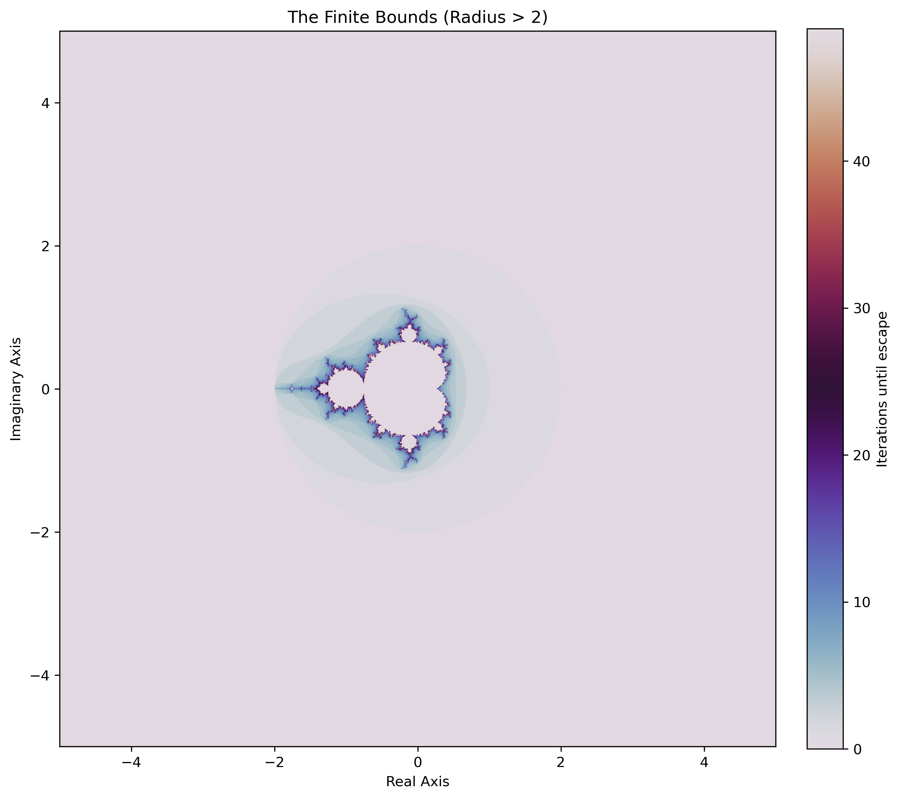
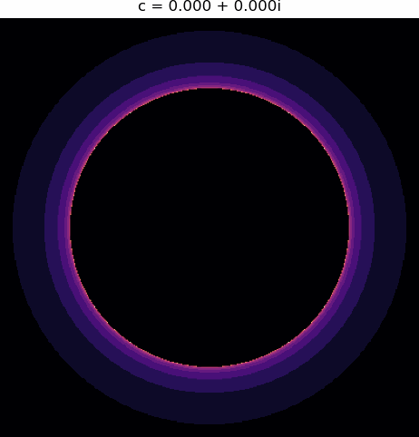
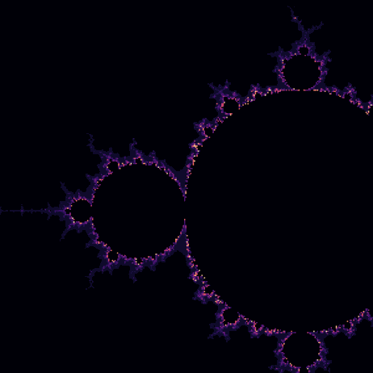

# Mandelbrot Set: A Case Study in Emergent Complexity

## The Macro View: The Basin of Attraction
This image represents the complete set of points $c$ in the complex plane for which the orbit of $z_{n+1} = z_n^2 + c$ remains bounded. In terms of **Dynamical Systems Theory**, the black interior represents a basin of attraction (a region of high stability), while the highly fractal boundary represents the **"Edge of Chaos"**—a critical phase transition where the system exhibits maximal sensitivity to initial conditions.

---

## The Mega View: Topological Constraints vs. Infinite Density
Despite its infinite internal detail, the Mandelbrot set is strictly finite in its physical extent. 

**Scientific Observation:** This image, zoomed out to a range of -5 to 5 on both axes, shows the entire Mandelbrot set as a small speck in the center. The vast, uniform region surrounding it represents the "vacuum" where points escape to infinity almost immediately. 

**The Proof of Finiteness:** Mathematically, it is proven that if the magnitude of $z$ ever exceeds 2 during iteration, it will inevitably escape to infinity. Therefore, the entire, infinitely complex set is contained entirely within a circle of radius 2 on the complex plane. 

**Connection to Physics:** This mirrors physical phase spaces: while a system (like a biological network) may be constrained within a strictly finite physical volume or energy bound, the internal state space it can explore remains infinitely dense.

---

## The Morphing Julia Set: Parameter Sensitivity

This animation shows the "Internal State Space" (Julia Set) as the "Environment Constant" ($c$) moves from the center of the Mandelbrot set to the boundary.

### Technical Observation:
1. **Continuous Deformation:** Because the path of $c$ is continuous, the resulting fractal transforms smoothly. This is a visual demonstration of **Sensitivity to Parameters**.
2. **Boundary Proximity:** The closer $c$ gets to the Mandelbrot boundary, the more "unfolded" and complex the Julia set becomes. Complexity is maximized at the interface between stability and chaos.

---

## The Infinite Flight: Computational Irreducibility

This animation demonstrates the property of scale invariance by zooming exponentially into a specific coordinate on the boundary.

### Scientific Synthesis:
* **Scale:** The final frame is roughly $100,000\times$ smaller than the first.
* **Computational Irreducibility:** As the magnification increases, we must proportionally scale the `max_iter` limit. This visually proves that the fractal's boundary is computationally irreducible; there is no mathematical "shortcut" to predict the state of a deep boundary point without simulating every discrete iterative step.
* **Information Theory Takeaway:** The visual "flight" demonstrates how simple deterministic rules can generate infinite, non-repeating Shannon entropy. This dynamic is a foundational model for understanding how microscopic rules generate macroscopic complexity.

---

## Computational Implementation
Generating these animations requires calculating billions of non-linear iterations. To achieve this without extreme compute latency, the simulation engine utilizes:
* **JIT Compilation:** Core orbital logic is wrapped in Numba (`@jit(nopython=True)`) to bypass Python's Global Interpreter Lock, allowing for C-level execution speeds during deep zoom calculations.
* **Dynamic Resolution Scaling:** For the "Infinite Flight," rendering steps are dynamically adjusted based on the zoom factor, prioritizing CPU cycles for regions with the highest phase-space curvature.
* **Asset Pipeline:** Raw arrays are converted and cached via the `Pillow` library to generate continuous `.gif` loops and high-DPI `.png` prints for portfolio presentation.